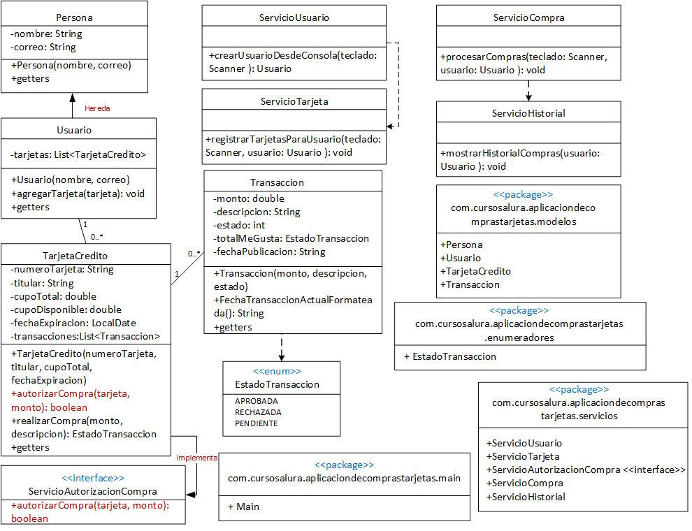
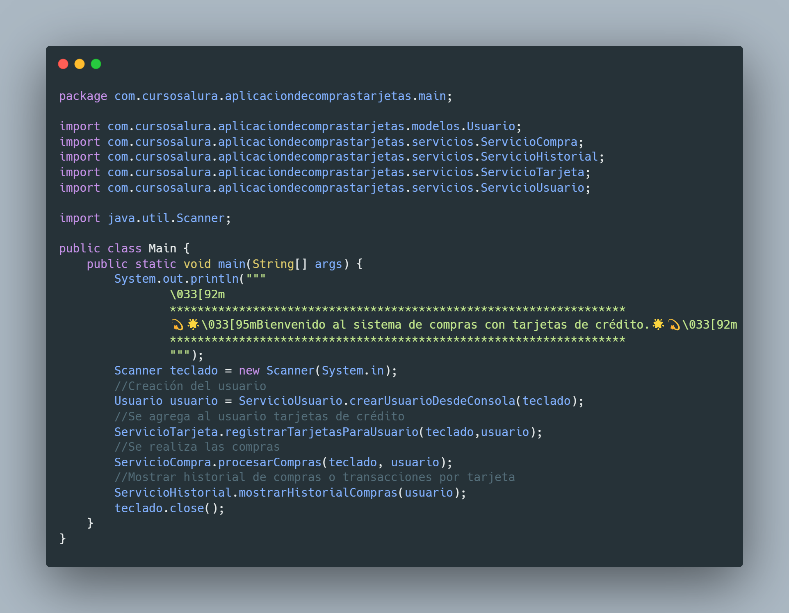
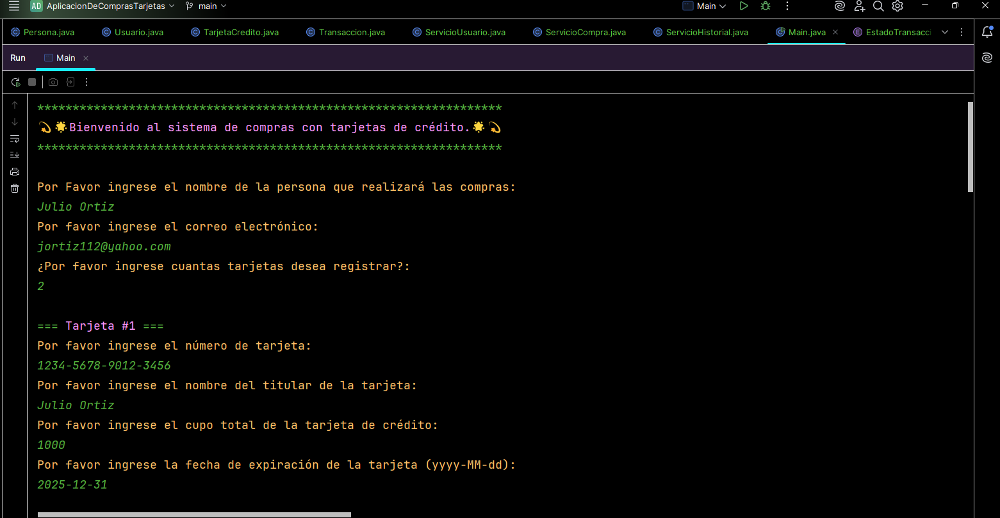
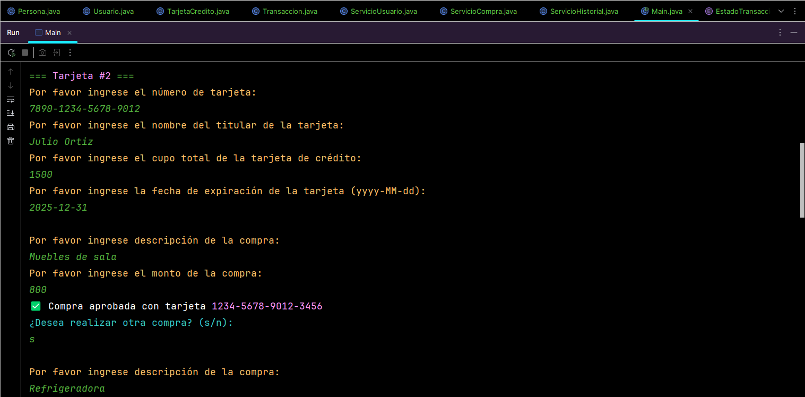
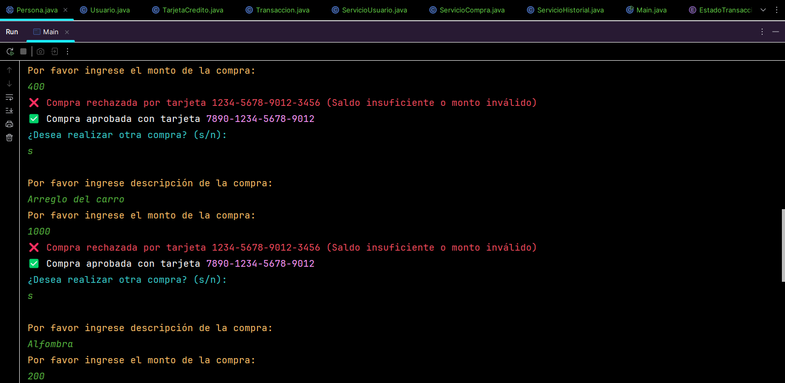
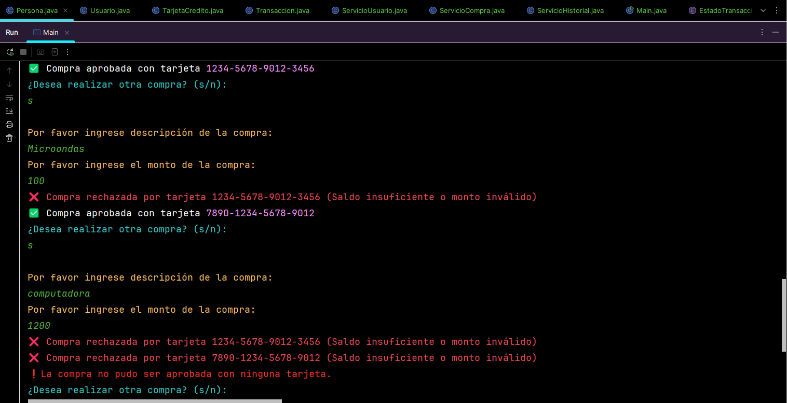
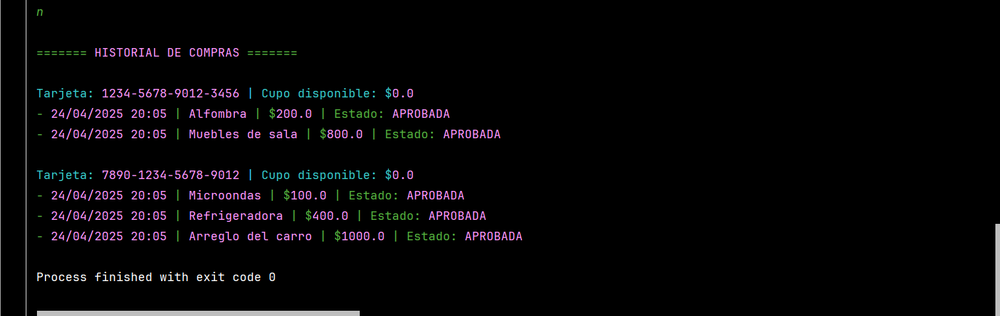

***
# <h1 align="center"> 💥Challenge Conversor de Monedas consumiendo ExchangeRate-API💥 </h1>
***



## 📄Descripción del proyecto

```sh

El desafío consiste en desarrollar una aplicación de compras que simule el uso de una tarjeta de 
crédito con un límite establecido.

Límite de la tarjeta: Al inicio, el usuario debe ingresar un límite para su tarjeta de crédito.

Realización de compras: El usuario podrá realizar compras ingresando el valor y la descripción de 
cada compra.

Control del saldo: La aplicación debe verificar si el saldo disponible es suficiente para realizar cada 
compra. Si el usuario intenta comprar algo que excede el límite, la aplicación debe informarle de saldo 
insuficiente.

Menú de opciones: Después de cada compra, el usuario debe tener la opción de continuar comprando o salir 
de la aplicación.

Orden de las compras: Al finalizar, la aplicación debe mostrar un resumen de las compras realizadas, 
ordenadas de menor a mayor valor.

```

## 📃Objetivos de aprendizaje

```sh

- Registrar usuarios y tarjetas de crédito asociadas.
- Procesar transacciones (compras)
- Validar autorizaciones según límites de crédito.
- Mantener un historial de movimientos.

```

## 🛠️Recursos y herramientas utilizados

```sh

- Trello: para organizar las tareas y el progreso del proyecto.
- Discord: para comunicarse con los compañeros y aclarar dudas.
- Cursos y formaciones de Alura Latam: para consultar contenidos relevantes y obtener más información.
- GitHub: para publicar y compartir el código del proyecto.
- LinkedIn: para conectarse con la comunidad y mostrar el aprendizaje adquirido.

```

## 🧱Tecnologías Utilizadas

✔️☕ Oracle Java OpenJDK 21.0.6

✔️🛠️ IntelliJ IDEA 2025 1.1.1

✔️✅ Estructura de carpetas orientada a paquetes lógicos: modelos, servicios, main y enumeradores.

## 🧭Estructura de paquetes:

      com.cursosalura.aplicaciondecomprastarjetas
      ├── modelos/        # Entidades
      ├── enumeradores/   # Estados
      ├── servicios/      # Lógica
      └── Main/           # Ejecución

## 🙏Contribuciones

>> Si deseas contribuir al proyecto, siéntete libre de hacer un fork del repositorio y enviar un pull request con tus mejoras o sugerencias.

## 🔆Resultados del Conversor de Monedas

>> 

>> 

>> 

>> 

>> 

>> 

## 👩👨Autores del Proyecto

>>     Programación Java POO, diagrama UML
>                               
>>>   Desafio puesto

## 📜Certificado

